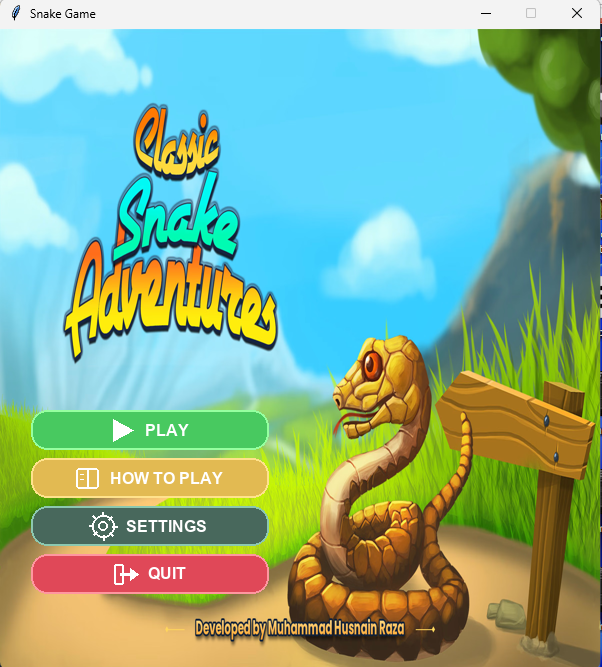

# 🐍 Snake Game

A modern and feature-rich Snake Game built with **Python and Tkinter**.

This project was developed as a desktop game for Windows, featuring custom graphics, background music, sound effects, high-score tracking, pause/resume functionality, and a Windows installer created using **Inno Setup**.

---

## 🎮 Features

- 🐍 Classic Snake gameplay
- 🎯 Score system
- 🏆 High-score system
- 💾 Persistent high-score saving
- 🎵 Background music
- 🔊 Sound effects
- ⏸️ Pause and resume functionality
- 🔄 Restart / Play Again functionality
- 🎨 Custom game graphics and UI
- 🖼️ Custom buttons and game assets
- 🚧 Wall collision detection
- 💀 Game-over system
- ⚙️ Saved game settings
- 📦 Windows installer
- 🪟 Standalone Windows application

---

## 📸 Game Screenshot



---

## 📥 Download

### 🪟 Windows

Download the latest Windows installer from the GitHub Releases page:

[](https://github.com/HusnainRaza313/Snake-Game-Python/releases/latest)

Download the `.exe` installer, run it, and follow the installation instructions.

> **Note:** The game is currently packaged for Windows.

---

## 🛠️ Technologies Used

- **Python**
- **Tkinter** – Graphical User Interface
- **Pillow (PIL)** – Image processing and custom graphics
- **JSON** – Saving settings and high scores
- **Winsound** – Windows sound effects
- **PyInstaller** – Packaging the Python application
- **Inno Setup** – Creating the Windows installer

---

## 📂 Project Structure

```text
Snake-Game-Python/
│
├── snake_game.py
├── snake_game.pyproj
├── Snake Game.spec
├── requirements.txt
├── .gitignore
│
├── background_music.wav
├── valid_icon.ico
│
├── game_screenshot.png
│
├── best_badge.png
├── glass_card.png
├── score_badge.png
│
├── pause_btn_hover.png
├── pause_btn_normal.png
├── play_again_btn_hover.png
├── play_again_btn_normal.png
├── resume_btn_hover.png
├── resume_btn_normal.png
│
├── start_background.png
├── start_btn_hover.png
├── start_btn_normal.png
│
├── snake_background.png
├── snake_body.png
├── snake_food.png
└── snake_head.png
▶️ Run From Source

If you want to run the game directly from the source code:

1. Install Python

Make sure Python is installed on your computer.

2. Clone the Repository
git clone https://github.com/HusnainRaza313/Snake-Game-Python.git
3. Open the Project Folder
cd Snake-Game-Python
4. Install Dependencies
pip install -r requirements.txt
5. Run the Game
python snake_game.py
📦 Build the Application

The project includes the PyInstaller specification file:

Snake Game.spec

This file can be used to build the Windows executable.

Build Command
pyinstaller "Snake Game.spec"

The generated application can then be packaged into a Windows installer using Inno Setup.

💾 Game Data

The game stores certain user data locally, such as:

High score
Game settings
Music preference
Sound-effect preference

These settings are saved locally on the user's computer.

🎯 Purpose of the Project

This project was created to practice and demonstrate skills in:

Python programming
GUI development
Object-oriented/problem-solving concepts
File handling
Audio integration
Image processing
Game logic
Application packaging
Windows software distribution
🚀 Future Improvements

Possible future improvements include:

Multiple difficulty levels
Additional game modes
More food types
Special power-ups
Leaderboard system
More visual effects
Cross-platform support
Online high-score system
👨‍💻 Developer

Muhammad Husnain Raza

ADP Computer Science Student

Interests
🐍 Python
💻 C++
📱 Flutter
🌐 Web Development
🤖 Artificial Intelligence
⭐ Support

If you like this project, consider giving the repository a ⭐ on GitHub!

Feedback and suggestions are welcome.

📄 License

This project is available for educational and personal use.


